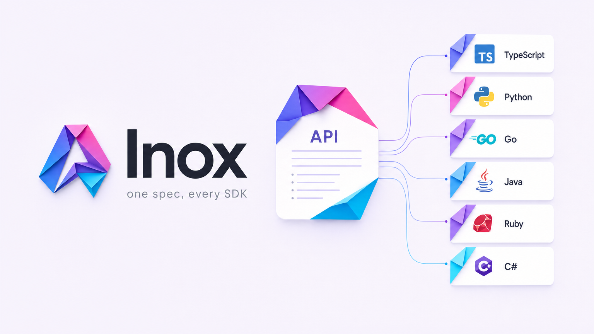

<p align="center">
  
</p>

<h1 align="center">Inox</h1>

<p align="center"><b>One spec, every SDK.</b><br>
Point Inox at your OpenAPI spec and get idiomatic SDKs in six languages, an MCP
server, and a CLI — self-hosted, air-gapped, zero runtime dependencies, verified
on every build.</p>

<p align="center">
  <a href="https://github.com/CREVIOS/inox/actions/workflows/ci.yml"></a>
  <a href="https://crevios.github.io/inox/"></a>
  
  
  
</p>

<p align="center">
  <a href="https://crevios.github.io/inox/"><b>Live site →</b></a> &nbsp;·&nbsp;
  <code>TypeScript</code> · <code>Python</code> · <code>Go</code> · <code>Java</code> · <code>Ruby</code> · <code>C#</code>
</p>

---

## Why now

In May 2026 Anthropic [acquired Stainless](https://techcrunch.com/2026/05/18/anthropic-has-acquired-the-dev-tools-startup-used-by-openai-google-and-cloudflare/)
and began **winding down its hosted SDK generator**; Fern was
[absorbed by Postman](https://buildwithfern.com/post/stainless-pricing-alternatives).
The teams that depended on a hosted pipeline now need one they can **run
themselves, forever, offline**. Inox is that — and aims to be better than what it
replaces.

## 60-second proof

A real production API. A **13-line** config. SDKs that compile.

```bash
curl -sL https://raw.githubusercontent.com/openai/openai-openapi/master/openapi.yaml -o openai.yaml
inox generate -c openai.sdkgen.yml --target typescript --out out
cd out/typescript && npx tsc --noEmit -p tsconfig.json     # 3,160 files, 0 errors
```

Inox auto-derives resources, methods, every schema, pagination, and auth from the
spec. You declare only package names, the base URL, and the auth scheme.

### Tested on real, public specs

Each row is a public OpenAPI spec → minimal config → generated TypeScript SDK →
`tsc --noEmit`. **11 of 12 compile with zero errors**, no per-spec tuning.

| API | Operations | Types | TS files | `tsc` |
|---|---:|---:|---:|:---:|
| Stripe | 587 | 11,275 | 11,356 | ✅ 0 |
| OpenAI | 242 | 3,119 | 3,160 | ✅ 0 |
| DigitalOcean | 632 | — | 55 | ✅ 0 |
| Plaid | 330 | 2,317 | 2,323 | ✅ 0 |
| Box | 296 | 1,456 | 1,534 | ✅ 0 |
| Asana | 247 | 1,202 | 1,255 | ✅ 0 |
| Discord | 233 | 1,111 | 1,132 | ✅ 0 |
| Ory | 59 | 235 | 244 | ✅ 0 |
| Twilio | 58 | 83 | 110 | ✅ 0 |
| Adyen | 28 | 465 | 477 | ✅ 0 |
| SendGrid | 3 | 7 | 14 | ✅ 0 |
| GitHub | 1,186 | 6,817 | 6,869 | 68 (in progress) |

## Any API → agent tools

```bash
inox products -c openai.sdkgen.yml --out out      # writes out/mcp
node out/mcp/dist/server.js --tools typed --scope read   # zero-dep MCP server, read-only
```

A best-in-class MCP server per API (protocol 2025-06-18): **typed / dynamic / code**
tool modes (auto-picked by API size), HTTP-verb-derived annotations
(`readOnlyHint` / `destructiveHint`), stdio + streamable-HTTP transports, OAuth from
config, and least-privilege flags. The generator itself also runs as an MCP server
(`inox mcp`) so agents can drive generation.

## How it compares

| | Inox | Stainless | Speakeasy | Fern | OpenAPI Generator |
|---|:---:|:---:|:---:|:---:|:---:|
| Self-hosted / air-gapped | ✅ | ❌ wound down | partial | partial | ✅ |
| Zero-dependency runtime | ✅ | ✅ | 1 dep | deps | ❌ |
| Runtime endpoint conformance (6 langs) | ✅ | — | — | — | ❌ |
| SBOM + SLSA provenance built-in | ✅ | partial | — | — | ❌ |
| Governance + breaking-change gate | ✅ | partial | partial | — | ❌ |
| MCP server from spec | ✅ | ✅ | — | — | ❌ |
| Price | free / OSS | acquired | $$ | $250/mo/SDK | free |

## What you get per SDK

Idiomatic clients with nested subresources (sync + async in Python) · **auth**
(bearer / API key / OAuth2 client-credentials with refresh + 401 re-auth) · **retries**
with backoff + jitter · timeouts · idempotency keys · named **environments** ·
**5 pagination schemes** with auto-iterators · multipart upload · **SSE/JSONL
streaming** · WebSocket clients · Standard-Webhooks HMAC verification · OpenTelemetry
hooks · optional runtime response validation · per-language skip/only.

**Platform:** spec-derived mock + cross-language runtime conformance · custom-code
three-way-merge overlay · SemVer release engineering + changelog · governance lint ·
CycloneDX SBOM + SLSA provenance + OIDC publishing · docs / CLI / MCP / Terraform /
React hooks / CI · offline Studio.

## Commands

```text
inox init        Scaffold a sample sdkgen.yml + openapi.yaml
inox lint        Validate config/spec; --governance runs the policy ruleset
inox generate    Generate SDKs (+ mock); overlay-merges custom code by default
inox verify      Compile + test every target, incl. endpoint conformance vs the mock
inox diff        Classify IR changes for SemVer; --gate fails CI on a breaking change
inox release     Plan a SemVer release; write CHANGELOG + notes
inox products    Generate docs, CLI, MCP server, Terraform provider, CI automation
inox mcp         Run the generator itself as an MCP server (agents drive generation)
inox sbom        Write a CycloneDX SBOM per target
inox studio      Serve the offline Studio web UI
```

## Quickstart

```bash
npm install
npm run sdkgen -- init --force
npm run sdkgen -- generate --out generated
npm run sdkgen -- verify  --out generated      # PASS typescript/python/go/java/ruby/csharp
```

## Continuous integration

[`/.github/workflows/ci.yml`](.github/workflows/ci.yml) sets up all six toolchains
(Node, Python, Go, Java, Ruby, .NET) and runs `npm run check`, the governance lint,
and the full end-to-end generate-and-verify across every language on each push and PR.
[`/.github/workflows/pages.yml`](.github/workflows/pages.yml) deploys the landing
site to GitHub Pages on every push to `main`.

## License

MIT.
